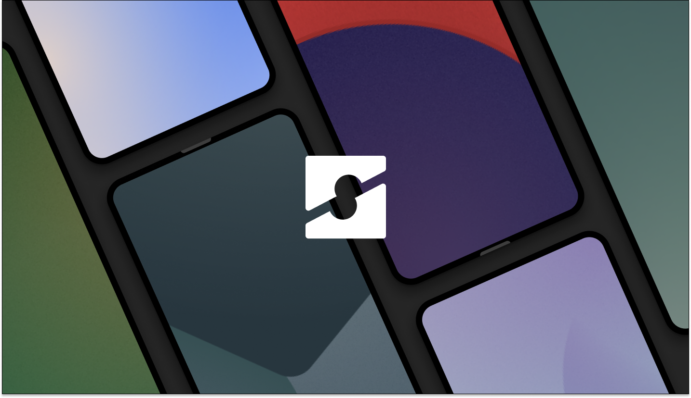

The Styx Project is a simple, clean, beautiful Android based custom ROM that strives to provide a stable and fluid experience, with minimal enhancements and features to bring out the most out of your Android device.

To get started with Styx, you'll need to get
familiar with [Repo](https://source.android.com/source/using-repo.html) and [Version Control with Git](https://source.android.com/source/version-control.html).

### Build Environment.

**Initializing the manifest.**

```
repo init -u https://github.com/StyxProject/android -b S
```

**Syncing the source.**

```
repo sync -j$(nproc --all) --force-sync --no-tags --no-clone-bundle --prune --optimized-fetch
```

**Building.**

```
source build/envsetup.sh
lunch device-buildtype
m styx-ota
```

> **Notes**  
If your device requires LineageOS SE rules, you will have to inherit the rules manually from `device/styx/sepolicy`.

### Credits.
 * [**LineageOS**](https://github.com/LineageOS)
 * [**Paranoid Android**](https://github.com/AOSPA)
 * [**Pixel Experience**](https://github.com/PixelExperience)
 * [**ProtonAOSP**](https://github.com/ProtonAOSP)
 * [**StormbreakerOSS**](https://github.com/StormbreakerOSS)
 * And the list never ends.